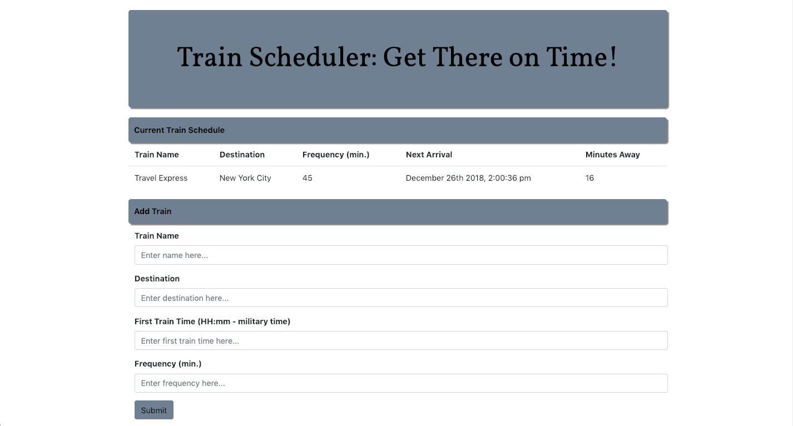

This is an app that facilitates the process of scheduling trains: it functions as a tool for planning vacations, commutes, and various types of travel.  It allows users to input information about trains: their names, destinations, first arrival times, and frequencies. The app uses this information to tell the user when the next train will arrive, and how many minutes away it is. To use it, please visit this URL: https://tomstone76.github.io/TrainScheduler/

Technologies used: 

Technologies used:
JavaScript, 
JQuery, 
HTML, 
CSS, 
Bootstrap, and 
Firebase

